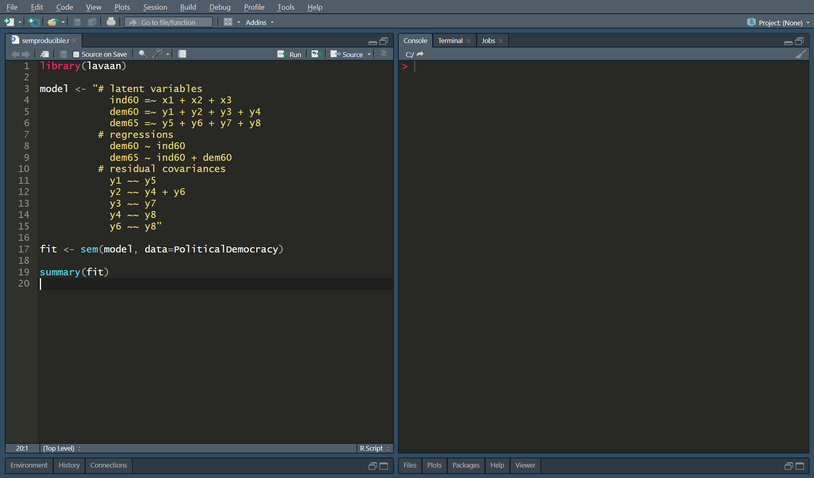

# Semproducible reproduce a lavaan model

**Semproducible** is an R package that make your latent variable models in [lavaan](http://lavaan.ugent.be/) reproducible. Semproducible generates all the necessary data and R code from your existing lavaan model.

This helps with open science without the need to disclose the raw data that might be sensitive, but still gives other researchers the ability to reproduce your results.

Benefits:

- only one line of code to reproduce your model
- the generated code fit a journal appendix
- researchers can reproduce your model (and try alternative model specifications)



## Install

```r
devtools::install_github("peterdalle/semproducible")
```

## Usage

```r
semproducible(x, formula)
```

Where `x` is either a lavaan model or a data frame.

And `formula` is the lavaan formula syntax (e.g., `latent =~ x1 + x2 + x3`).

## Examples

### 1. Generate code for a lavaan model

When you have an existing lavaan model and you want to generate code to make it reproducible.

```r
library(lavaan)
library(semproducible)

# Example: http://lavaan.ugent.be/tutorial/sem.html
formula <- "# latent variables
              ind60 =~ x1 + x2 + x3
              dem60 =~ y1 + y2 + y3 + y4
              dem65 =~ y5 + y6 + y7 + y8
            # regressions
              dem60 ~ ind60
              dem65 ~ ind60 + dem60
            # residual covariances
              y1 ~~ y5
              y2 ~~ y4 + y6
              y3 ~~ y7
              y4 ~~ y8
              y6 ~~ y8"

fit <- sem(formula, data=PoliticalDemocracy)

# Reproduce lavaan model.
code <- semproducible(fit, formula)

# Show generated code.
cat(code)
```

### 2. Generate code for a data frame

When you have a data frame with many variables, and you want other researchers to choose variables to model.

```r
library(semproducible)
library(tidyverse)

iris %>% 
  select(Sepal.Length, Sepal.Width, Petal.Length, Petal.Width) %>% 
  semproducible(formula = "Sepal.Length ~ Sepal.Width + Petal.Length") %>% 
  cat()
```

## What the generated code looks like

If you run example 2 above, the generated code will look like this:

```r
library(tibble)
library(lavaan)

# Number of observations.
observations <- 150

# Covariance matrix.
cov_mat <- tribble(~Sepal.Length, ~Sepal.Width, ~Petal.Length, ~Petal.Width,
              0.685693512304251, -0.0424340044742729, 1.27431543624161, 0.516270693512304,               
              -0.0424340044742729, 0.189979418344519, -0.329656375838926, -0.12163937360179,               
              1.27431543624161, -0.329656375838926, 3.11627785234899, 1.29560939597315,               
              0.516270693512304, -0.12163937360179, 1.29560939597315, 0.581006263982103)

# Convert data frame to matrix (that lavaan can handle).
cov_mat <- as.matrix(cov_mat)

# Rows should have names too.
rownames(cov_mat) <- colnames(cov_mat)

# SEM model in lavaan syntax.
formula <- 'Sepal.Length ~ Sepal.Width + Petal.Length'

# Fit SEM model.
fit <- lavaan::sem(formula, sample.cov = cov_mat, sample.nobs = observations)

# Show results.
summary(fit)
```

And if you also run the generated code above, the output will be successfully reproduced:

```
lavaan 0.6-5 ended normally after 19 iterations

  Estimator                                         ML
  Optimization method                           NLMINB
  Number of free parameters                          3
                                                      
  Number of observations                           150
                                                      
Model Test User Model:
                                                      
  Test statistic                                 0.000
  Degrees of freedom                                 0

Parameter Estimates:

  Information                                 Expected
  Information saturated (h1) model          Structured
  Standard errors                             Standard

Regressions:
                   Estimate  Std.Err  z-value  P(>|z|)
  Sepal.Length ~                                      
    Sepal.Width       0.596    0.069    8.677    0.000
    Petal.Length      0.472    0.017   27.849    0.000

Variances:
                   Estimate  Std.Err  z-value  P(>|z|)
   .Sepal.Length      0.109    0.013    8.660    0.000
```

## Questions

- [How do I save my code to a file?](https://github.com/peterdalle/semproducible/wiki#how-do-i-save-my-code-to-a-file)
- [Do I need to specify all columns?](https://github.com/peterdalle/semproducible/wiki#do-i-need-to-specify-all-columns)
- [How do I control the width of the code?](https://github.com/peterdalle/semproducible/wiki#how-do-i-control-the-width-of-the-code)
- [Can I use semproducible in a `tidyverse` pipeline?](https://github.com/peterdalle/semproducible/wiki#can-i-use-semproducible-in-a-tidyverse-pipeline)
- [How do I know that my generated code is correct?](https://github.com/peterdalle/semproducible/wiki#how-do-i-know-that-my-generated-code-is-correct)

## Documentation

Load semproducible and then run `?semproducible` in the R console to view the full documentation.

## Support

Report problems or request a new feature by [submitting a new issue](https://github.com/peterdalle/semproducible/issues/new).

## Contribute

You can help with:

- Test semproducible in your project, and [report a bug](https://github.com/peterdalle/semproducible/issues/new)
- Read the documentation and verify that it corresponds to actual behavior

## License

[MIT](LICENSE)
